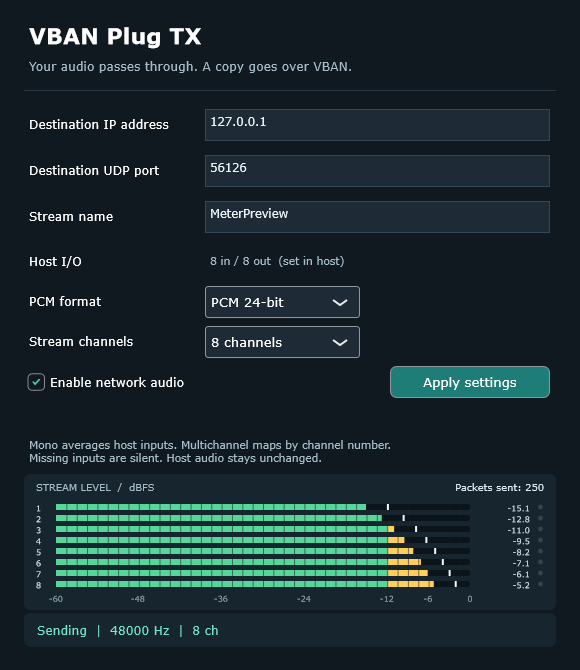
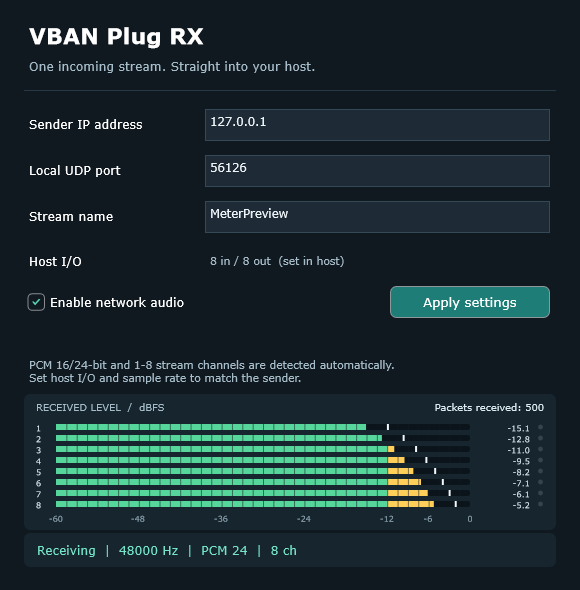
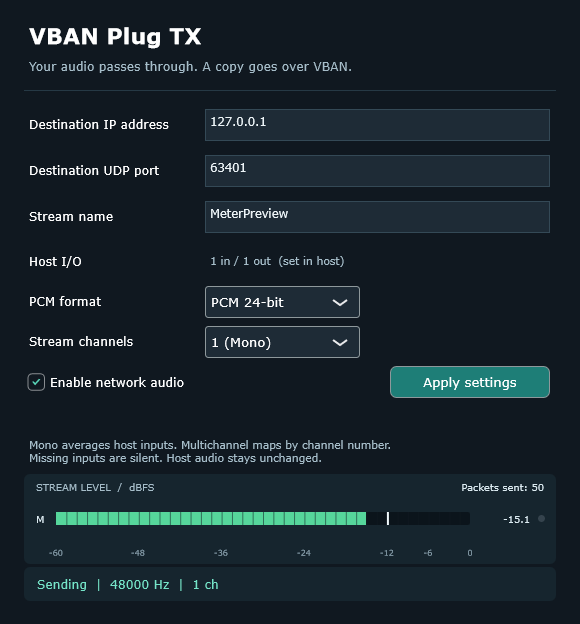
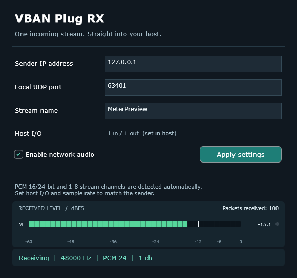
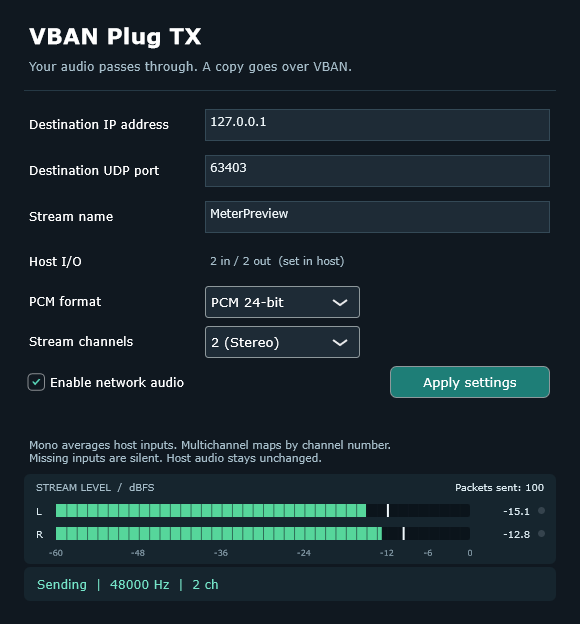
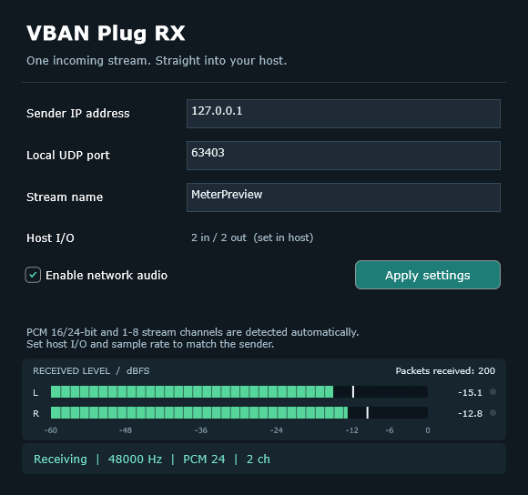
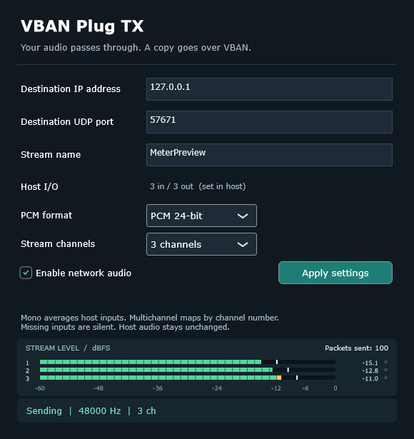
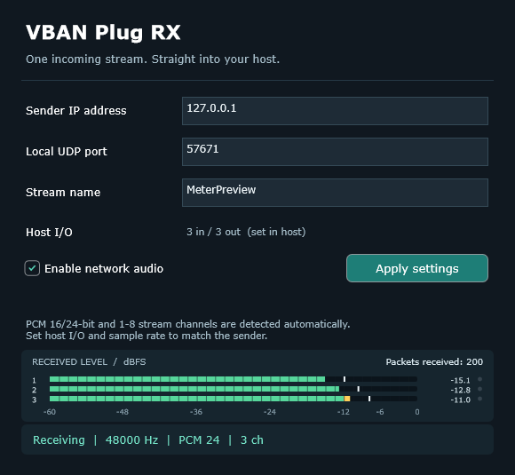
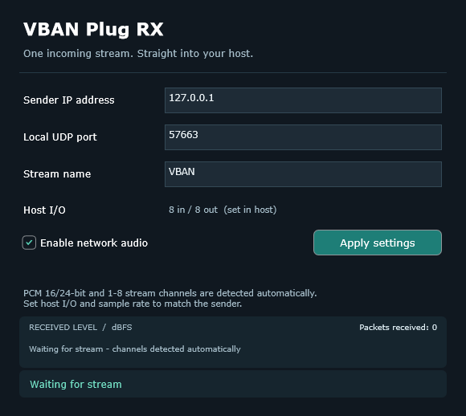

# VBAN Plug


**Two lightweight Windows VST3 plug-ins for sending and receiving VBAN audio.**

**TX** sends one stream with 1–8 channels while host audio passes through unchanged.
**RX** receives one matching stream and plays it in your audio host. Separate plug-ins,
simple network settings, one horizontal meter per stream channel, and live packet counters.

[**Download v0.2.1**](https://github.com/torment78/vban-plug/releases/tag/v0.2.1)
 · [Installation guide](docs/INSTALL.md)
 · [Report an issue](https://github.com/torment78/vban-plug/issues)

[](https://ko-fi.com/msffixit)

Free and open source under [AGPL-3.0](LICENSE). Donations support development and are optional.

VBAN Plug is made by **ElkaSoft**. The **VBAN protocol** and **Voicemeeter** are by
[VB-Audio](https://vb-audio.com/Voicemeeter/vban.htm).

## Download and install

Version **0.2.1** is the multichannel test release for **Windows 10/11 x64**.
Use a 64-bit host that supports VST3.

| Download | Contents |
| --- | --- |
| [Windows installer](https://github.com/torment78/vban-plug/releases/download/v0.2.1/VBAN-Plug-0.2.1-Windows-x64-Setup.exe) | Dark ElkaSoft installer for both TX and RX, with an optional Donate button. |
| [Portable ZIP](https://github.com/torment78/vban-plug/releases/download/v0.2.1/VBAN-Plug-0.2.1-Windows-x64-Portable.zip) | Both complete VST3 bundles, instructions, licences, and artwork in one VBAN Plug folder. |
| [Source ZIP with JUCE](https://github.com/torment78/vban-plug/releases/download/v0.2.1/VBAN-Plug-0.2.1-Source.zip) | Project source, build scripts, artwork, and the exact JUCE sources used for the binaries. |
| [SHA256 checksums](https://github.com/torment78/vban-plug/releases/download/v0.2.1/SHA256.txt) | Checksums for the installer and both ZIPs. |

Close your audio host, run the installer, and then rescan VST3 plug-ins in the host.
Both plug-ins go to:

```text
C:\Program Files\Common Files\VST3
```

For manual installation, extract the portable ZIP and copy the **entire**
`VBAN Plug TX.vst3` and `VBAN Plug RX.vst3` folders there. Keep their
`Contents`, `Resources`, `moduleinfo.json`, and `x86_64-win` files together.
Use one installation method and keep one copy of each plug-in.

The builds are unsigned. No separate Microsoft Visual C++ runtime download is needed.
See the [installation guide](docs/INSTALL.md) for updates and removal.

## Editors

| Transmit | Receive |
| --- | --- |
|  |  |


The main previews show eight-channel operation. Mono uses one bar; stereo uses L/R. RX waits to detect the stream before showing any channel bars.

<details>
<summary>Channel-count editor previews</summary>

| Transmit | Receive |
| --- | --- |
|  |  |
|  |  |
|  |  |

RX before a matching stream arrives, with eight host connections available:



</details>

## TX settings

| Setting | Meaning |
| --- | --- |
| Destination IP address | IPv4 address of the receiving computer. |
| Destination UDP port | Port listened to by the receiver; default 6980. |
| Stream name | Exact case-sensitive name, 1–16 printable ASCII characters. |
| PCM format | 16-bit or 24-bit signed PCM. |
| Stream channels | 1 (mono), 2 (stereo), or 3–8 numbered channels in one VBAN stream. |

Enter the settings and enable network audio. Changes to text/drop-down fields are activated with **Apply settings**. New instances start disabled.

The network copy is quantized/clipped to the selected PCM format; host audio is never modified by TX. Packet encoding and UDP socket operations happen on the network worker. Queue overload drops network packets without blocking the host audio callback.

## RX settings

| Setting | Meaning |
| --- | --- |
| Sender IP address | Only packets from this exact source IPv4 are accepted. |
| Local UDP port | The port this plug-in listens on. |
| Stream name | Must match the sender exactly. |

PCM 16/24-bit and 1–8 stream channels are detected automatically. RX shows one meter for every received channel, even when the host has fewer output connections. Before the first matching packet arrives, it shows **Waiting for stream** with no channel bars. For example, choose **3 channels** in TX and click **Apply settings**: TX sends three channels in one stream and RX automatically shows three meters. The host's eight available connections do not add extra meters.

RX and the sending system must use the **same nominal sample rate**, for example 48000 Hz. The editor reports a mismatch and outputs silence until corrected. A small adaptive receive buffer follows clock drift using fractional interpolation; this version does not convert between different nominal sample rates. Typical buffering is about 20 ms or two host blocks, whichever is larger, plus network scheduling. RX is a live source and does not request host delay compensation.

No matching signal, a disabled RX, or a sample-rate mismatch produces silence. Packet gaps/reordering and overflows cause recovery/rebuffering, rather than indefinite stale playback. Allow roughly half a second for a freshly restarted external sender to be recognised if its packet counter restarts.

Each active RX needs a free local UDP port. Two RX instances cannot share the same port, and RX cannot bind a port already occupied by VoiceMeeter or another receiver. Use different ports for separate receivers.

The source address is the remote computer's IP, not the local bind address. RX listens on local interfaces and filters the sender. IPv4 unicast is supported; multicast, broadcast destinations, hostnames, compressed audio and more than eight channels are outside this version.

Settings are saved in the host project. TX passes audio through when bypassed; RX bypass outputs silence. Network audio is paused for offline processing, so record RX audio in real time before offline exporting. The host must keep processing the insert to transmit/receive, including when transport is stopped. If packets do not arrive from another PC, check the host application's Windows Firewall permission for the chosen UDP port.

## Host inputs, outputs, and routing

Both plug-ins advertise **eight input and eight output connections by default**.
The host can select matching layouts from **1 to 8 channels**, including mono, stereo,
and 7.1/eight-channel layouts. RX also accepts a disabled input bus. These are
audio channels within one bus and one VBAN stream.

Use your host's track/bus configuration or plug-in pin-routing menu to choose the
layout and connect the channels. The exact menu depends on the host; some hosts only
support stereo inserts. The editor's **Host I/O** row shows the negotiated connections.
TX's **Stream channels** drop-down controls the network stream, independently of the
host's bus layout. Selecting eight there cannot create additional host connections.

- For an eight-channel link, set both host layouts to eight channels, connect inputs
  1–8 to TX and outputs 1–8 from RX, and select **8 channels** in TX.
- Multichannel routing follows channel number. TX sends the first selected channels;
  missing input channels are sent as silence. Host pass-through still preserves all inputs.
- TX mono averages all configured host input channels. A mono host input is duplicated
  only when sending stereo.
- RX maps incoming channels to corresponding host outputs and silences extra outputs.
  A mono stream is duplicated on a stereo host output; a mono host output averages
  all received channels.
- RX still displays all received meters if the host has fewer outputs, with a **Host:
  N out** status. Configure the host for eight outputs to hear all eight separately.

Existing mono/stereo stream settings remain compatible with saved projects.
After updating, rescan the plug-ins so your host refreshes their available layouts.

## Levels and packet counters

Both editors show one horizontal meter per stream channel, refreshed at 60 Hz: one bar for mono, L/R for stereo, and thinner numbered bars for 3–8 channels. Bars show a 50 ms RMS envelope in dBFS; white markers retain brief peaks for 750 ms, and red clip lights stay visible for one second. The meters fall smoothly and return to silence when audio processing stops.

TX measures the selected stream after channel mapping/mono mixing and before PCM quantization, including while network transmission is disabled. RX measures every decoded stream channel before adapting it to the host outputs. A mono stream has exactly one meter.

The meter header always displays **Packets sent** in TX or **Packets received** in RX, refreshed at 10 Hz. RX counts accepted matching-stream packets, not unrelated UDP traffic. Totals remain visible when a stream stops and reset when network settings are applied. A rising received count with silent meters can help identify a silent source or a sample-rate mismatch.

Metering reads audio without changing it and publishes levels through lock-free atomics.

## Local test

1. Load RX on a stereo track. Set sender IP to `127.0.0.1`, local port `6980`, and stream name `VBAN`. Enable it.
2. Load TX on another track containing audio. Set the same IP, destination port and stream name. Choose PCM and channels, then enable it.
3. Use the same host sample rate. RX's status should show the detected format.
4. For eight channels, configure eight host inputs/outputs on both plug-ins and choose **8 channels** in TX. Feed different audio into each TX input and check the eight RX meters/outputs.
5. Avoid routing the RX output back into TX.

## Build in Visual Studio 2026 Insiders

Install **Desktop development with C++**, the **v145 toolset**, Windows SDK, and
**C++ CMake tools for Windows**. CMake 4.2 or later is required.

```powershell
git clone https://github.com/torment78/vban-plug.git
cd vban-plug
.\Build.ps1 -Open
```

This discovers Visual Studio 2026 Insiders, builds Release, runs the audio/UDP/VST3
tests, captures the editors, and opens `build/vs2026-insiders-x64/VBANPlug.slnx`.
Use `.\Build.ps1 -ConfigureOnly -Open` to configure and open without building.
CMake remains the source of truth for the generated solution.

JUCE **8.0.13** is pinned to commit
`7c9d3783b127263d72bb65fe0a7e2dc8a02a7ac2`, with its download checksum verified.
A fresh clone downloads it from the official JUCE repository. The source release
already includes it in `external/JUCE`. An explicit `VBAND_JUCE_DIR` override is
also supported.

Install [Inno Setup 6.6 or later](https://jrsoftware.org/isinfo.php), then create the
installer, portable ZIP, and source ZIP with:

```powershell
.\Build.ps1 -Package
```

`.\Build-Release.ps1` is an equivalent release entry point. Outputs are under
`out/releases/<version>`; neither command installs into the system VST3 folder.
See [release building and verification](docs/RELEASING.md).

## Tests and implementation

The test suite covers PCM encoding, exact pass-through, saved state, real loopback
UDP, stream/IP filters, every 1–8 channel layout in both PCM formats, live format changes,
channel ordering, mono mixing, silent padding, metering, and VST3 scan/load/editor creation.
The VST3 host checks verify that both compiled plug-ins advertise eight connections,
accept all 1–8 channel layouts, and process every channel in float and double precision.
Installer checks cover installation, reinstallation, matching payloads, removal,
and preservation of unrelated files.

```powershell
.\packaging\Test-Release.ps1
```

This uses a temporary folder under `build/package-tests`; it does not install into
your real VST3 folder. This multichannel build has passed the automated audio,
plug-in loading, and isolated installer checks. Visual installer review and testing
in additional DAWs are still welcome. No hosted build workflow is claimed: releases
are currently built locally with Visual Studio 2026 Insiders.

Protocol code follows the [VBAN PCM specification](https://vb-audio.com/Voicemeeter/VBANProtocol_Specifications.pdf).
Packets are capped at 1464 bytes, including the 28-byte header. Audio is little-endian
interleaved signed PCM. Network workers use bounded queues; the audio processing
methods perform no socket calls, mutex acquisition, or heap allocation.

## Support and credits

Found a problem or have an idea? Use [GitHub Issues](https://github.com/torment78/vban-plug/issues).
For bugs, include the plug-in version, audio host/version, sample rate, block size,
TX/RX settings, and what the packet counters show.

If VBAN Plug is useful to you and you would like to support continued development,
you can [donate on Ko-fi](https://ko-fi.com/msffixit), or use the **Donate** button in
the installer. Donations are completely optional—thank you for supporting ElkaSoft.

[](https://ko-fi.com/msffixit)

Useful links:

- [VBAN protocol and tools](https://vb-audio.com/Voicemeeter/vban.htm)
- [Voicemeeter](https://voicemeeter.com/)
- [JUCE framework](https://juce.com/)
- [Steinberg VST3 documentation](https://steinbergmedia.github.io/vst3_dev_portal/)
- [OBS VBAN Audio by ElkaSoft](https://github.com/torment78/obs-vban-audio)

**VBAN Plug is an independent ElkaSoft project, not an official VB-Audio or Steinberg
product.** ElkaSoft created this plug-in; VB-Audio created the VBAN protocol and
Voicemeeter. No Voicemeeter Remote DLL is required or bundled.

Copyright © 2026 ElkaSoft. Licensed under **GNU AGPL v3**; see [LICENSE](LICENSE).
Third-party code and artwork retain their respective notices; see [NOTICE.md](NOTICE.md).
